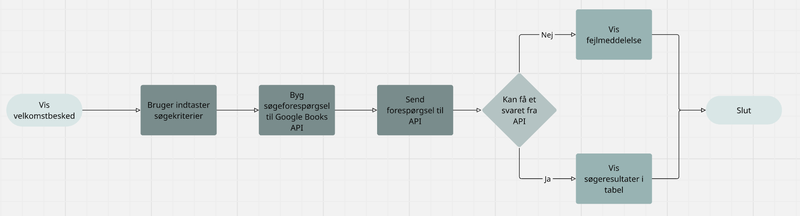

Bogsøgningsprogram for Historie Studerende   
Af Jessica & Marie 2r   
11-05-2025

# Synopsis
## Projektbeskrivelse 
 Mille er en historie studerende der går på københavns universitet. Mille skal snart op i historie eksamen og skal derfor på bibliotekt for at finde de specifike bøger hun skal bruge. Hun skal finde specifikke tidsperioder, forfattere, titler og årstal. Men det er et meget stort bibliotek så hun har derfor brug for en computer program hvor hun kan slå bøgerne op for at vide hvilke bøger hun skal brugeuden at spilde en hel dag på at lede på biblioteket.

 Hvad Mille ønkser man kan søge efter i computer programmet:
* Titel
* Genre... fx. fiktion, fantasi osv.
* Fortatter
* Bogtype... fx. roman, digte osv.
* Tidsperioder... fx. romantiken osv.
* Årsdatoer 

## Kravspecifikation
| titel            	| Beskrivelse                                                                         	| prioritet    	|
|------------------	|-------------------------------------------------------------------------------------	|--------------	|
| Søging           	| Man skal kunne søge på bøger, ved titel, forfatter, gernre osv.                     	| need-to-have 	|
| Menu             	| Man skal kunne gå ind under forskellige kategorier                                  	| nice-to-have 	|
| Program struktur 	| Det skal være struktureret med tabeller så brugere for et hurtigt og bedre overblik 	| nice-to-have 	|
| Forside af bøger 	| Man skal kunne se bøgernes forside når man går ind på dem                           	| nice-to-have 	|

## Programbeskrivelse 
Når programmet starter mødes brugeren med en kort velkomstbesked. Herefter bliver brugeren bedt om at indtaste en eller flere søgekriterier. Alle felter er frivillige, så brugeren bestemmer selv hvor præcist søgningen skal være. Når input er givet, samler programmet alle dataen til en samlet søgeforespørgsel, der bliver sendt til Google Books server.

Hvis Google Books API finder dataen, udtrækker programmet oplysninger som bogens titel, forfatter, udgivelsesår og forsidebillede. Disse resultater bliver vises pænt i en tabel, så de er nemme at læse. Hvis der derimod opstår en fejl f.eks. hvis internettet er nede, eller Google ikke svarer, vises en fejlmeddelelse.

### Programbeskrivelse med rutediagrammer
Vi har valgt at lave to forskellige flowcharts. Det ene flowchart hedder "use-case" det viser hvordan en person kan bruge programmet samt hvilke muligheder de har. Det andet flowchart hedder "program-logik" som er et flowchart der viser program logikken bag koden når en person prøver det.

Use-case:

Program-logik:
 

## Arbejdsfordeling
**Marie** Har lavet hele programmet, herunder fundet den rigtig Google Books API webadresse og udvikling af synopsen.   
**Jessica** Hjælper med at lave kravspecifikationen, rette stavefejl, teste programmet og undersøgt forskellige teknikker til vores kode. I starten kunne hun ikke åbne programmet, dette fik vi rette et stykke tid men problemet opstod igen senere.

## Kilder og ressourcer
- **Google Books API**: Anvendt til at hente bogdata baseret på brugerens søgekriterier.
- **ChatGPT**: Brugt til at finde og vælge det mest passende API samt til at hjælpe med planlægning og fejlfinding af programmet.
- **Markdown Table Generator**: Brugt til at oprette kravspecifikationen i tabelformat.

## Brug af AI
1) Vi brugte Chatgtp for at finde den bedste API der ville dække over alle vores krav til hvad man skal kunne søge efter. Først sprurgte vi om "find et API der kan gøre dette:" og derefter indsatte vi hele vores projektbeskrivelse, her gav den os tre forslag. Vi spurget den så "hvilken er det nemmeste tror du?" hvor den gav os Google Books API som den nemmeste der opfylder vores krav. Vi gjorde det for at finde en API som ville opfylde alle vores krav uden vi skulle bruge for lang tid på at lede. Samtidig mener vi ikke at det er særlig væsentligt at chat er kommet på det API som vi skulle bruge, da vi højst sansynligt alligevel ville have valgt et API magen til.

## Evaluering og vurdering
Programmet opfylder sit formål: at gøre det nemt at søge efter bøger online via Google Books API. Brugeren kan selv vælge søgekriterier, og programmet henter relevante bogoplysninger og viser dem i en tabel. Det er enkelt, effektivt og et godt projekt til datahåndtering og API.    
Programmet opfylder de fleste af de krav, vi har sat for os selv, som at kunne søge og vise bogresultater. Dog mangler vi funktioner som at vise konkrete bogforsider og muligheden for at gemme resultater. Fremtidige forbedringer kan inkludere bedre præsentation af programmet samt ekstra funktioner som søgehistorik.
