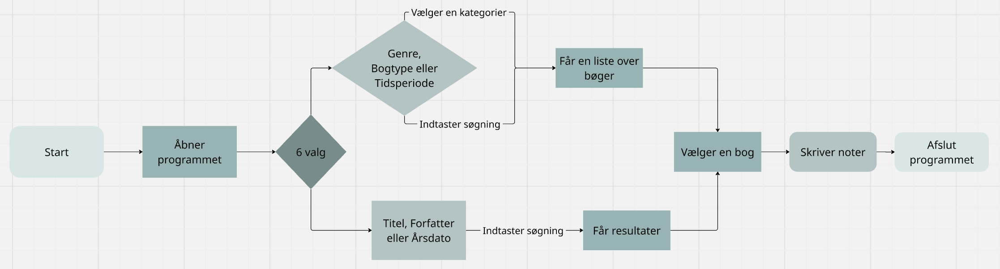

Jessica & Marie 2r
# Synopsis
## Projektbeskrivelse 
 Mille er en historie studerende der går på københavns universitet. Mille skal snart op i historie eksamen og skal derfor på bibliotekt for at finde de specifike bøger hun skal bruge. Hun skal finde specifikke tidsperioder, forfattere, titler og årstal. Men det er et meget stort bibliotek så hun har derfor brug for en computer program hvor hun kan slå bøgerne op for at vide hvilke bøger hun skal brugeuden at spilde en hel dag på at lede på biblioteket.

 Hvad Mille ønkser man kan søge efter i computer programmet:
* Titel
* Genre... fx. fiktion, fantasi osv.
* Fortatter
* Bogtype... fx. roman, digte osv.
* Tidsperioder... fx. romantiken osv.
* Årsdatoer 

## Kravspecifikation
| titel            	| Beskrivelse                                               	| prioritet    	|
|------------------	|-----------------------------------------------------------	|--------------	|
| Søge maskine     	| Man skal kunne søge på bøger                              	| need-to-have 	|
| Menu             	| Man skal kunne gå ind under forskellige kategorier        	| nice-to-have 	|
| Flot program     	| Det skal se indbydende ud for brugeren                    	| nice-to-have 	|
| Forside af bøger 	| Man skal kunne se bøgernes forside når man går ind på dem 	| nice-to-have 	|

## Programbeskrivelse med rutediagrammer
Vi har valgt at lave to forskellige flowcharts. Det ene flowchart hedder "use-case" det viser hvordan en person kan bruge programmet samt hvilke muligheder de har. Det andet flowchart hedder "program-logik" som er et flowchart der viser program logikken når en person prøver det.

Use-case:

## Rolle-fordeling (arbejdsfordeling)
Redegørelse for arbejdsfordelingen i gruppen.

## Kilder og ressourcer
Redegørelse for brug af eksterne ressourcer og kilder.

## Brug af AI
Redegørelse for brug af AI.

## Evaluering og vurdering
Sammenfattende konklusion og vurdering.